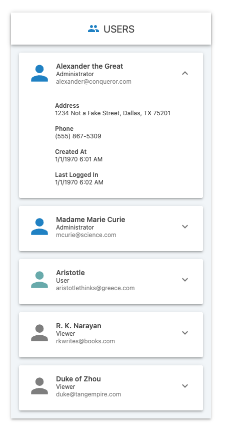

# User Component

This is a single-page react app created using [Next.js](https://nextjs.org/docs/basic-features/typescript) and [Material UI](https://mui.com/). It reads a list of users from the `users.json` file and creates appropriate user cards based on the user role.



# Installation

Please run the commands below to install and run the app on `http://localhost:3000/`:

```
npm i
npm run dev
```

You can run the command below to run the unit tests for the `formatDate` and `formatPhoneNumber` functions.

```
npm test
```

# Directory Structure

## components

This is the parent folder that contains all of the reusable components.

- ### Format
  - This folder contains the different formatting functions for date and phone number.

* ### Theme

  - This is the folder for the theme of the application.

* ### Users

  - This is the folder that contains the `.tsx` files for the reusable User component.

## images

This is the parent folder for all of the images for the application.

- ### icons
  - This contains all of the icons for the user roles.

## tests

This folder contains basic tests for the `formatDate` and `formatPhoneNumber` functions.
